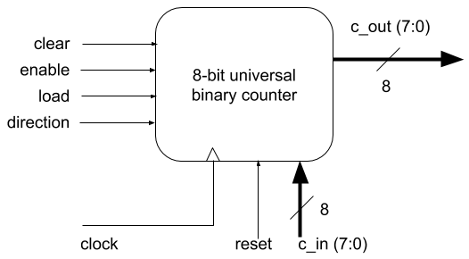
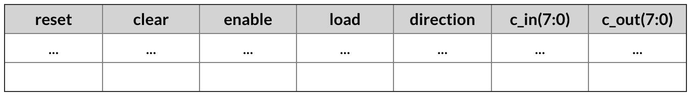

# universal-binary-counter
Consider an 8-bit universal binary counter supporting an asynchronous reset input plus four synchronous inputs to clear the outputs, to enable the operation of the counter, to load an 8-bit initial count value (c_in(7:0)), and to define the counting direction (up / down).

1.Use the template below to create a function table describing the operation of this circuit.

N.B.: Please notice that "reset" is an asynchronous control input (contrary to the remaining inputs, it does not need a rising edge in clock to cause effect), and as such it might be preferable to remove it from this table, since it will probably be handled in the code section describing the state register, while all the remaining inputs will be handled in the outputs section – nevertheless it is included above just for the sake of completeness.

2. Create a VHDL design file complying with the functional requirements presented in the previous table.
3. Prove the correctness of your design by simulation in Vivado.
4. How would you change the function table and design file if you wanted to change the relative priority of the clear and load inputs?
 
# Design
The table and the code is in the src folder inside vhd file.
Simulation file is in testbench folder.
